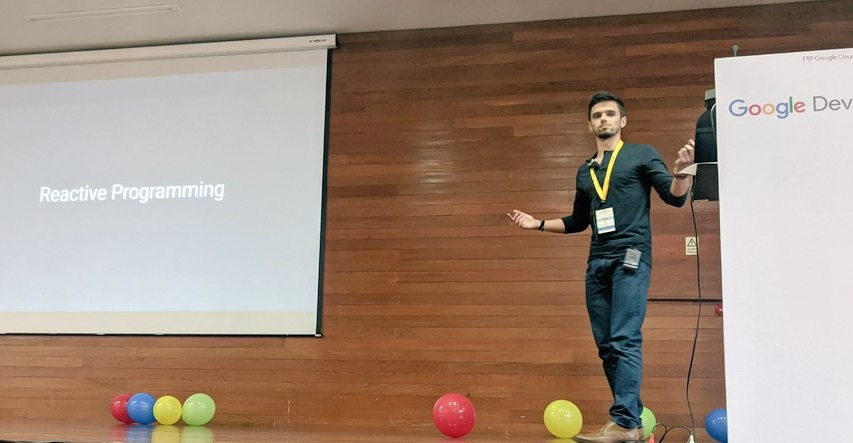

## Me

Hi! I'm Ricardo. I'm a software engineer from Portugal, currently living in the magical city of Coimbra (the one pictured in the home page). I'm shy at first and have a natural resting bitch face, but if you talk to me you'll soon find out that I'm actually nice and funny (I'm way too proud of my sense of humor). I care about the world and try to do my share part in order to preserve it (although I admit I don't do nearly as much as I could). I see people, not genders or ethnicities. When I work, I like to keep things pragmatic and professional, but I also know how to party when the time comes ;)

 

I’ve done a lot of stuff in software: from backend to frontend, from data-centric security to developing apps for aging people that don't even have the notion of what is a "button" in terms of an application. I’ve seen some sh\*t, but ever since I found about Android years ago (back in the ICS days), it became my one true love.

As a developer, I:

- Think that software that works is good, but software that works **and** is also readable by a human is the best;
- Understand that **technical debt** is the second constant in software development (**change** being the first);
- Am used to work with both legacy code (AsyncTasks, anyone?) and hip new tech that kids use these days (Rx, Jetpack, DI frameworks, etc);
- Love Kotlin (but remember Java for all good things it did for me, in spite of all the bad ones);
- Have a deep care for software architecture and love to refactor accordingly.

At the footer of this page, you have links for a bunch of different platforms. Feel free to reach out!

## The blog

This blog is a somewhat lightweight version of [Jasper2](https://github.com/jekyller/jasper2), a Jekyll port of [Ghost's default theme Casper v2](https://github.com/tryghost/casper). My purpose with the blog is twofold: to use it as a place where I can write about anything I want (mostly Android) and to use it as a personal website where I can aggregate my "digital footprint" - hence the links for other platforms.
